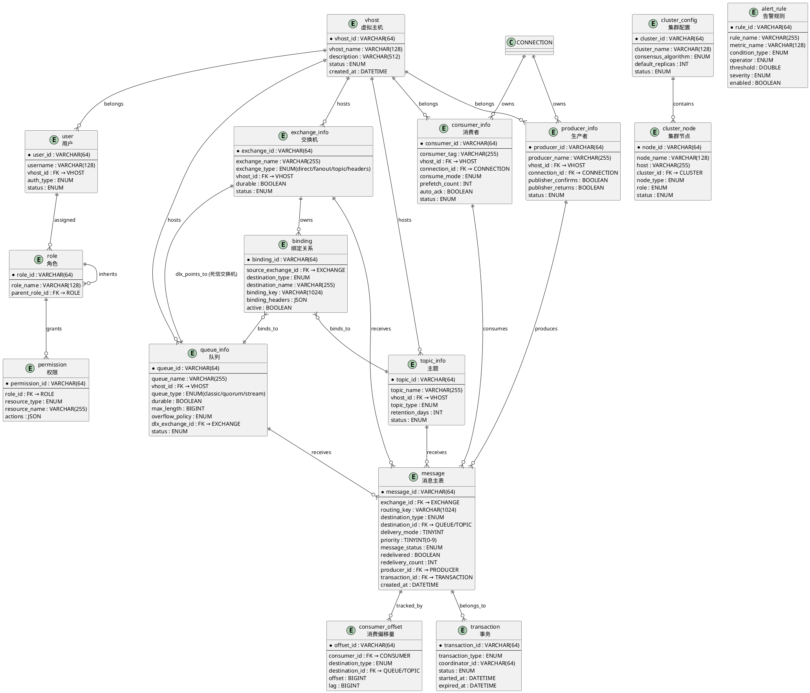
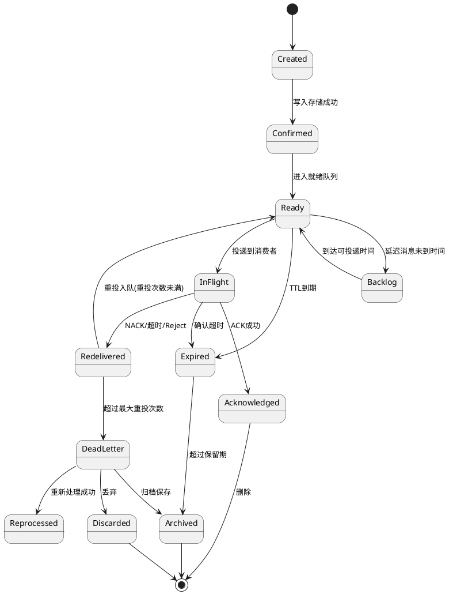
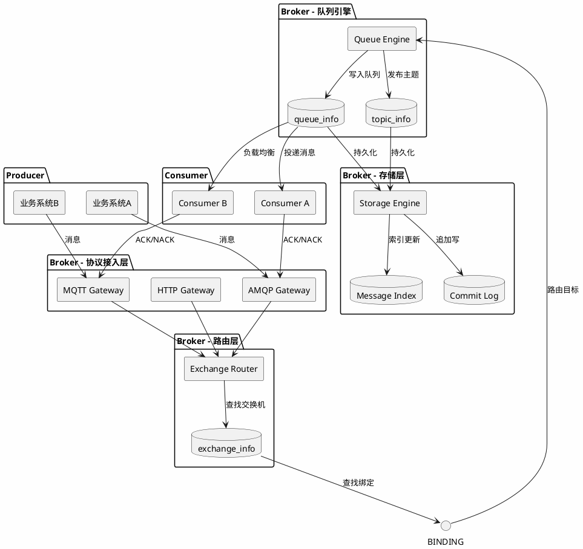
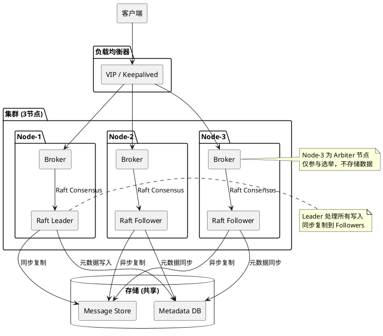
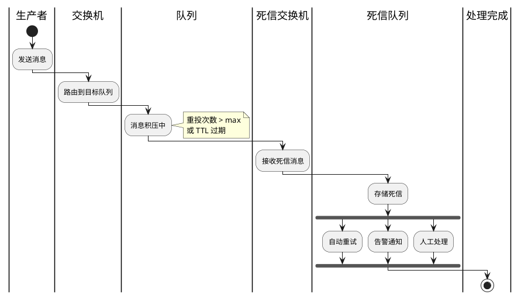
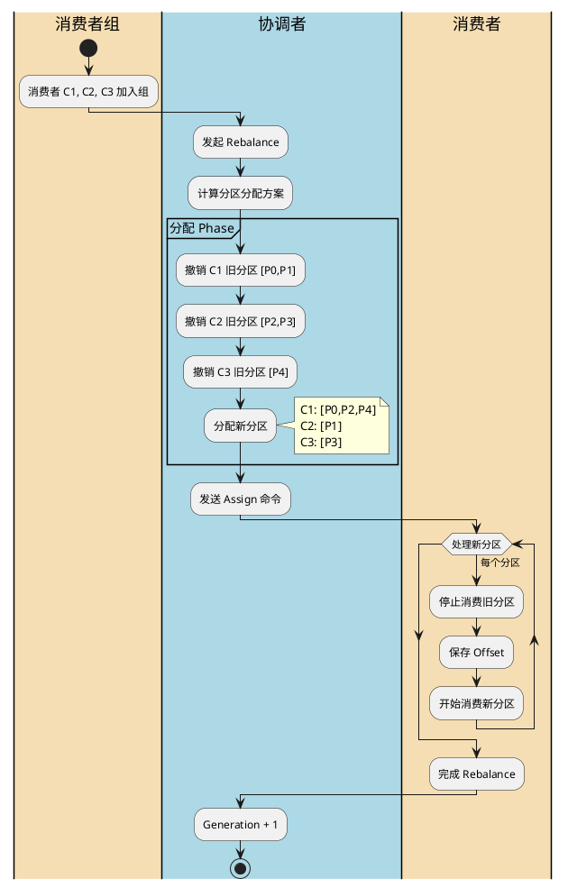

# ER 关系图与架构图

> 本文件使用 PlantUML 语法绘制 ER 图，可在 VS Code / IntelliJ / PlantUML Online Viewer 中渲染。

---

## 1. 核心实体关系总览

---

## 2. 消息完整生命周期状态机

---

## 3. 消息路由架构图

---

## 4. 集群高可用架构图

---

## 5. 死信处理流程图

---

## 6. 消费者分组 Rebalance 流程

---

*文档版本：v1.0 | 更新日期：2026-03-29*
